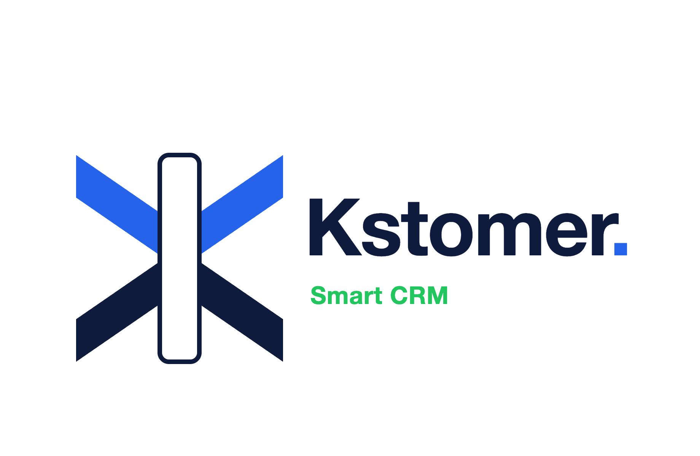

<div align="center">

<picture>
  <source media="(prefers-color-scheme: dark)" srcset="public/kstomer-horizontal-on-dark.png">
  <source media="(prefers-color-scheme: light)" srcset="public/kstomer-horizontal-on-light.png">
  
</picture>

### Le CRM efficace, précis et sans bruit pour les solopreneurs.

[](https://react.dev)
[](https://www.typescriptlang.org/)
[](https://tanstack.com/start)
[](https://tailwindcss.com)
[](https://supabase.com)
[](https://stripe.com)
[](https://vercel.com)

</div>

---

## À propos

Kstomer aide les fondateurs solo et les consultants à reprendre le contrôle de leurs ventes en quelques minutes : un pipeline Kanban, un carnet de contacts unifié, des rappels de tâches et des analyses légères, le tout dans un seul outil, pensé pour la rapidité, la clarté et la confiance. Pas de CRM d'entreprise surchargé, pas de bruit, juste ce dont une activité commerciale d'une seule personne a réellement besoin.

## Fonctionnalités

- 🗂️ **Pipeline Kanban** — suivi des affaires par glisser-déposer (`@dnd-kit`)
- 📇 **Carnet de contacts unifié** — un seul endroit pour chaque prospect et client
- ✅ **Tâches et rappels de relance** — ne laissez jamais tomber une affaire
- 📊 **Insights assistés par IA** — un agent Claude à appel d'outils diagnostique la situation et propose les prochaines étapes sur le Tableau de bord (dont une carte de prospects suggérés par l'IA), les Tâches, l'Analytique et les Revendeurs
- 🤝 **Gestion des revendeurs / portefeuille** — suivez les partenaires et leurs pipelines
- 🏢 **Support multi-organisation** — basculez entre les entreprises, avec un parcours d'onboarding guidé en 3 étapes (profil → informations sur l'entreprise → import CSV) entièrement navigable dans les deux sens
- 📥 **Import CSV de contacts** — importez des contacts en masse (prénom/nom, entreprise, email, téléphone, étape, dates) depuis l'onboarding ou la page Contacts, avec détection des doublons par email et rejet des fichiers non-CSV déguisés en `.csv`
- 💳 **Facturation intégrée** — Stripe Checkout, checkout intégré, portail de facturation et gestion des abonnements
- 🌍 **Multilingue** — français, espagnol et anglais, avec détection automatique par IP

## Stack technique

| Couche | Stack |
|---|---|
| **Framework** | [TanStack Start](https://tanstack.com/start) + [TanStack Router](https://tanstack.com/router) (routage basé sur les fichiers, SSR), React 19, Vite 8, Nitro (cible Cloudflare) |
| **UI** | Tailwind CSS v4, [shadcn/ui](https://ui.shadcn.com) (style new-york) sur les primitives Radix UI, `lucide-react`, `recharts` |
| **Données et formulaires** | TanStack Query, `react-hook-form` + `zod` |
| **Back-end** | [Supabase](https://supabase.com) — Postgres, Auth, Row Level Security |
| **Paiements** | SDK [Stripe](https://stripe.com), utilisé directement (pas d'abstraction de passerelle) |
| **IA** | Claude (`@anthropic-ai/sdk`), appelé directement — boucle d'agent à appel d'outils, pas d'abstraction de passerelle |
| **i18n** | `i18next` / `react-i18next` (fr, es, en) |
| **Outillage** | TypeScript (strict), ESLint 9 (config flat), Prettier, Bun |

## Structure du projet

```
src/
├── routes/                  # Routes TanStack Router basées sur les fichiers
│   ├── index.tsx            # Page d'accueil marketing
│   ├── pricing.tsx          # Page des tarifs
│   ├── auth*.tsx            # Connexion / réinitialisation du mot de passe / callback OAuth
│   ├── checkout.return.tsx  # Retour après Stripe Checkout
│   ├── api/public/payments/webhook.ts  # Gestionnaire du webhook Stripe
│   ├── api/cron/warm-ai-cache.ts       # Vercel Cron : préchauffe le cache d'insights IA des Tâches
│   └── _authenticated/      # Tableau de bord, kanban, contacts, tâches,
│                             # analytique, revendeurs, archives, paramètres
├── components/               # Coque de l'app, palette de commandes, UI de checkout, ...
│   └── ui/                   # Primitives shadcn/ui
├── hooks/                    # use-tasks, use-subscription, use-organizations, ...
├── lib/                      # pricing-plans, stripe, i18n, utils
│   ├── crm-ai-tools.server.ts       # Définitions d'outils partagées pour les cartes d'insights IA
│   ├── dashboard-ai.functions.ts    # Fonction serveur d'insights IA pour le Tableau de bord
│   ├── tasks-ai.functions.ts        # Fonction serveur d'insights IA pour les Tâches
│   ├── analytics-ai.functions.ts    # Fonction serveur d'insights IA pour l'Analytique
│   ├── resellers-ai.functions.ts    # Fonction serveur d'insights IA pour les Revendeurs
│   ├── prospects-ai.functions.ts    # Carte de prospects suggérés par l'IA (Tableau de bord)
│   └── csv-contacts.ts              # Analyse/validation CSV pour l'import de contacts en masse
├── integrations/supabase/    # Clients Supabase navigateur + serveur, auth, types DB
└── assets/
supabase/
└── migrations/                # Migrations SQL
public/                        # Ressources de marque, favicon, llms.txt
```

## Démarrage

**Prérequis :** [Bun](https://bun.sh) (recommandé) ou Node.js 20+

```bash
# 1. Installer les dépendances
bun install
# ou : npm install

# 2. Configurer les variables d'environnement (voir ci-dessous) dans .env / .env.development

# 3. Lancer le serveur de développement
bun run dev
```

## Scripts disponibles

| Script | Description |
|---|---|
| `bun run dev` | Démarre le serveur de développement Vite |
| `bun run build` | Build de production |
| `bun run build:dev` | Build en mode développement |
| `bun run preview` | Prévisualiser un build de production en local |
| `bun run lint` | Lancer ESLint |
| `bun run format` | Formater le code avec Prettier |

> Aucune suite de tests automatisés n'existe pour l'instant.

## Variables d'environnement

La configuration non sensible et les emplacements vides des secrets se trouvent dans le fichier `.env` versionné ; les secrets sont définis dans le **tableau de bord Vercel** (Settings → Environment Variables), sans être commités dans le dépôt.

| Variable | Où elle est définie | Notes |
|---|---|---|
| `SUPABASE_URL` / `VITE_SUPABASE_URL` | `.env` (versionné) | URL du projet Supabase (serveur / client) |
| `SUPABASE_PUBLISHABLE_KEY` / `VITE_SUPABASE_PUBLISHABLE_KEY` | `.env` (versionné) | Clé anon/publique Supabase (serveur / client) |
| `SUPABASE_SERVICE_ROLE_KEY` | Vercel uniquement | Secret serveur uniquement — utilisé par le gestionnaire du webhook Stripe et le client Supabase serveur privilégié |
| `STRIPE_SECRET_KEY` | Vercel + `.env.development` en local | Clé de test : `sk_test_…` |
| `STRIPE_LIVE_SECRET_KEY` | Vercel uniquement | Clé live : `sk_live_…` (en production) |
| `VITE_PAYMENTS_CLIENT_TOKEN` | `.env.development` / Vercel | Clé publiable Stripe (`pk_test_…` ou `pk_live_…`) — le mode sandbox vs. live est déduit de ce préfixe |
| `PAYMENTS_SANDBOX_WEBHOOK_SECRET` | Vercel uniquement | Secret de signature du webhook Stripe (mode test) — vérifie les requêtes vers `/api/public/payments/webhook` |
| `PAYMENTS_LIVE_WEBHOOK_SECRET` | Vercel uniquement | Secret de signature du webhook Stripe (mode live) |
| `ANTHROPIC_API_KEY` | Vercel uniquement | Secret serveur uniquement — clé API Claude utilisée par les fonctions d'insights IA du Tableau de bord, des Tâches, de l'Analytique, des Revendeurs et des Prospects |
| `CRON_SECRET` | Vercel uniquement | Authentifie les requêtes Vercel Cron qui appellent `/api/cron/warm-ai-cache`, `/api/cron/renewal-reminders` et `/api/cron/organization-archival` |
| `SUPABASE_PROJECT_ID` / `VITE_SUPABASE_PROJECT_ID` | `.env` (versionné) | Référence de projet Supabase CLI (serveur / client) |

## Base de données

> ⚠️ **Terminologie** : le modèle multi-utilisateurs repose sur l'entité `organizations`
> (propriétaire unique `owner_id`), et non `accounts`/`account_members` comme décrit
> dans certains documents historiques (PRD v1.1–v1.4, DBML v1.3). La bascule a eu lieu
> le 03/07/2026 (migrations `migrate_crm_tables_to_organizations` et
> `drop_orphaned_accounts_schema`).

Adossé à Supabase Postgres. Toutes les tables ont la Row Level Security activée, avec un périmètre par organisation (ou par utilisateur pour les tables au niveau du compte). Les changements de schéma sont versionnés sous forme de migrations SQL dans `supabase/migrations/`.

`profiles` (`id`, `email`, `full_name`, `avatar_url`, `phone`) est peuplée automatiquement à l'inscription via un trigger `on_auth_user_created` sur `auth.users`.

Kanban, Contacts, Tableau de bord, Analytique, Revendeurs, Archives, Tâches et facturation lisent et écrivent tous de vraies données Supabase — aucune page CRM n'affiche plus de données statiques/factices :

| Domaine | Tables |
|---|---|
| **CRM principal** | `contacts` (carte de pipeline / étape), `subscription_details`, `contact_notes`, `reseller_notes`, `stage_history` |
| **Revendeurs** | `resellers`, `reseller_contacts`, `reseller_contact_history` |
| **Organisation et opérations** | `organizations`, `profiles`, `user_roles`, `tasks`, `reminders`, `notifications` |
| **Facturation** | `subscriptions` |
| **IA** | `ai_insight_cache`, `ai_insights`, `ai_prompt_cache`, `agent_logs` |

`organizations` a gagné `is_test` (marque les comptes de test/démo, exemptés des limites de plan et des métriques métier, modifiable uniquement en SQL par un admin) et `archived_at` (archivage RGPD au niveau du compte, 12 mois avant suppression définitive, à l'image de `contacts`/`resellers`) le 14/07/2026. `contacts` a gagné `first_name` (obligatoire) et `last_name` (optionnel) le 14/07/2026, rétro-remplis depuis le `contact_name` existant ; `contact_name` reste la chaîne d'affichage dénormalisée unique utilisée partout ailleurs (listes, kanban, notifications, vues revendeurs, outils IA) et est maintenue synchronisée à partir de `first_name`/`last_name` à chaque création ou modification d'un contact — la page de détail du contact et l'import/modèle CSV capturent désormais le prénom et le nom comme des champs distincts, tandis que les autres points d'entrée (éditeur de carte kanban, ajout rapide mobile) prennent toujours un nom en texte libre unique et le séparent automatiquement. 19 tables au total, toutes avec la RLS activée. `contact_notes` / `reseller_notes` ont remplacé `notes` / `note_edit_history` le 13/07/2026 (plusieurs notes horodatées par contact/revendeur, sans historique de modification). Le front-end (pages de détail contact/revendeur, feuille d'ajout rapide mobile, et formulaire de nouveau contact) a été mis à jour le 14/07/2026 en conséquence — les notes sont ajoutées une par une via un bouton **enregistrer** explicite (pas de sauvegarde automatique) et listées de la plus récente à la plus ancienne ; l'ancienne interface à note unique avec sauvegarde automatique et historique de versions a disparu. `ai_insights`, `ai_prompt_cache`, `user_roles` et `agent_logs` sont actuellement vides — réservées à des fonctionnalités prévues (V2) plutôt qu'à un schéma mort. Schéma complet au niveau des champs : [`supabase/kstomer-schema-v1.4.dbml`](supabase/kstomer-schema-v1.4.dbml).

## Parcours d'inscription

- **Pas d'étape de confirmation par email (pour l'instant)** — comme l'envoi d'email sortant n'est pas configuré et que les inscriptions de test utilisent des adresses inexistantes, `supabase.auth.signUp` sur `/auth` n'attend plus un écran « vérifiez votre boîte mail » : dès que Supabase renvoie une session, l'utilisateur est envoyé directement vers l'onboarding. Cela nécessite que **« Confirm email » soit désactivé** dans le tableau de bord Supabase (Authentication → Providers → Email) — tant que c'est activé, `signUp` ne renvoie pas de session et l'envoi sortant se heurte à la limite de débit par défaut de Supabase (`429: email rate limit exceeded`) puisqu'aucun SMTP personnalisé n'est configuré.
- Le formulaire d'inscription ne collecte que **l'email et le mot de passe** — le nom complet est demandé une seule fois, à l'étape 1 de l'onboarding, sans être dupliqué sur `/auth`.
- L'onboarding est un parcours en 3 étapes, entièrement navigable dans les deux sens : profil (nom, rôle, préférences de notification) → informations sur l'entreprise (nom, ville, pays, description — alimente la carte de prospects suggérés par l'IA, qui nécessite que `organizations.description` ou `.city` soit renseigné) → import CSV de contacts. L'étape 1 propose une action « retour à la connexion » qui déconnecte l'utilisateur.

## Tarifs

Les plans sont définis dans [`src/lib/pricing-plans.ts`](src/lib/pricing-plans.ts) et facturés en EUR via Stripe. Les identifiants de prix sont des **lookup keys** Stripe — des lookup keys correspondantes doivent exister dans le tableau de bord Stripe pour chaque prix.

| Plan | Mensuel | Annuel (par mois) | Entreprises | Points forts |
|---|---|---|---|---|
| **Starter** | 17 € | 13 € | 1 | Usage solo, pipeline et rappels intelligents, tableau de bord IA personnalisé |
| **Expansion** ⭐ | 37 € | 28 € | Illimité | Multi-entreprise, pipelines illimités, analyse IA avancée du portefeuille |
| **Empire** | 67 € | 51 € | Illimité | Jusqu'à 5 utilisateurs, vues manager et KPI d'équipe, permissions et journal d'audit |

Tous les plans incluent un essai gratuit de 14 jours.

## Facturation et tâches de fond

- **Checkout et portail** — `createCheckoutSession` crée une session Stripe Checkout intégrée (prix résolu par lookup key) ; `createPortalSession` ouvre le portail de facturation Stripe pour les abonnés existants.
- **Webhook** — `src/routes/api/public/payments/webhook.ts` gère `customer.subscription.created/updated/deleted`, vérifie la signature (HMAC via `PAYMENTS_SANDBOX_WEBHOOK_SECRET` / `PAYMENTS_LIVE_WEBHOOK_SECRET`), et met à jour la table `subscriptions`. Le choix sandbox vs. live se fait via un paramètre de requête `?env=` sur le endpoint.
- **Cache des insights IA** — les cartes d'insights du Tableau de bord/Tâches/Analytique/Revendeurs/Prospects sont mises en cache dans `ai_insight_cache` et régénérées seulement une fois par jour (ou lors d'une actualisation manuelle), pour éviter d'appeler Claude à chaque chargement de page.
- **Vercel Cron** (`vercel.json`) — une tâche quotidienne appelle `/api/cron/warm-ai-cache` (protégée par `CRON_SECRET`) pour préchauffer le cache IA des Tâches ; les autres cartes restent mises en cache paresseusement pour éviter de mélanger les données entre locataires sous la RLS.
- **Archivage et purge RGPD au niveau du compte** — Paramètres → Sécurité → « Archiver mon compte » définit `archived_at` sur chaque organisation possédée par l'utilisateur, le déconnecte, et vide les requêtes en cache ; l'organisation disparaît immédiatement de l'application (`useOrganizations` filtre les organisations archivées et ne recrée pas automatiquement une nouvelle organisation par défaut pour ces utilisateurs). Se reconnecter en n'ayant que des organisations archivées redirige vers `/account-archived`, une page autonome affichant les jours restants dans la fenêtre de rétention de 12 mois, avec une action de **restauration** (efface `archived_at`) ou de déconnexion. `/api/cron/organization-archival` tourne quotidiennement et supprime définitivement toute ligne `organizations` encore archivée après 12 mois (les comptes `is_test` sont exclus) ; les clés étrangères en cascade suppriment tous les contacts, revendeurs, notes, rappels, etc. de cette organisation dans la même opération.
- **Routage des modèles IA** — Tableau de bord/Tâches/Analytique/Revendeurs utilisent Claude Haiku 4.5 (résumé de données déjà récupérées) ; Prospects utilise Sonnet 5 (raisonnement ancré sur une recherche web). Les prompts système utilisent la mise en cache de prompts (`cache_control: ephemeral`) pour réduire le coût en tokens.

## Déploiement

- **Plateforme :** [Vercel](https://vercel.com) — tous les déploiements passent par Vercel.
- **Éditeur :** le dépôt est aussi connecté à [Lovable.dev](https://lovable.dev) pour l'édition visuelle assistée par IA ; git reste la source de vérité.
- **Workflow :** les changements sont poussés directement sur `main` — pas de branches de fonctionnalités de longue durée.
